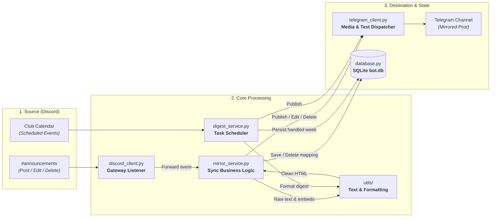

# Discord-to-Telegram Announcement Mirror Bot

A lightweight, reliable bridge bot that mirrors all announcements from a Discord `#announcements` channel to a Telegram announcements channel.

It operates strictly **one-way (Discord &rarr; Telegram)** and synchronizes new posts, edits, deletions, media attachments, and weekly upcoming Discord events into Telegram.

---

## Table of Contents

- [1. Overview](#1-overview)
- [2. User & Administrator Guide](#2-user--administrator-guide)
  - [For Discord Announcement Authors](#for-discord-announcement-authors)
  - [For Telegram Channel Administrators](#for-telegram-channel-administrators)
- [3. Deployment & Configuration Guide (Debian VM)](#3-deployment--configuration-guide-debian-vm)
  - [Prerequisites](#prerequisites)
  - [Step-by-Step Discord & Telegram Bot Setup](#step-by-step-discord--telegram-bot-setup)
  - [Environment Configuration (.env Reference)](#environment-configuration-env-reference)
  - [Production Deployment with Docker Compose](#production-deployment-with-docker-compose)
  - [Managing & Updating the Bot on Debian](#managing--updating-the-bot-on-debian)
  - [Automated Testing (Continuous Integration)](#automated-testing-continuous-integration)
- [4. Developer & Architecture Guide](#4-developer--architecture-guide)
  - [File Structure](#file-structure)
  - [Message Lifecycle (Data Flow)](#message-lifecycle-data-flow)
  - [Media & Character Limit Strategy (Discord Nitro vs Telegram)](#media--character-limit-strategy-discord-nitro-vs-telegram)
  - [Developer Cheat Sheet: Where to Add Features](#developer-cheat-sheet-where-to-add-features)
  - [Core Design Rules](#core-design-rules)
  - [Local Development & Running Tests](#local-development--running-tests)

---

## 1. Overview

The bot functions as an automated communication bridge designed for communities that publish announcements on Discord but want their Telegram community members to receive identical, real-time updates.

### Key Capabilities

- **New Announcements**: Mirrors text messages, rich embeds (title, description, fields, footer), and media attachments (photos, videos, documents, or multi-image albums).
- **In-Place Message Edits**: Edits made in Discord immediately update the corresponding Telegram post text in real-time.
- **Synchronized Deletions**: Deleting an announcement on Discord automatically deletes the mirrored message(s) on Telegram (including Discord bulk channel purges).
- **Markdown-to-HTML Translation**: Converts Discord markdown (bold, italic, underline, strikethrough, blockquotes, spoilers, hyperlinks, code blocks, headers, and mentions) into Telegram-compliant HTML.
- **Automated Weekly Events Digest**: Scans Discord's scheduled calendar events for the next 7 days and publishes an upcoming events summary in local time.
- **Crash Resilience**: Mappings and scheduler states are saved to a local SQLite database (`data/bot.db`) with DELETE rollback journal mode for Docker volume compatibility, ensuring full edit and delete synchronization across restarts.

---

## 2. User & Administrator Guide

### For Discord Announcement Authors

When you post in the monitored `#announcements` channel, the bot handles synchronization automatically:

1. **Formatting & Mentions**:
   - Standard Discord formatting (`**bold**`, `*italic*`, `__underline__`, `~~strikethrough~~`, `||spoiler||`, `> quote`) is automatically translated to Telegram formatting.
   - Discord headers (`#`, `##`, `###`, `-#`) are rendered using bold and italic HTML tags without syntax errors.
   - Mentions (`@user`, `@role`, `#channel`) are resolved against server names (e.g. `@p1ker1` instead of `<@123456789>`).
   - Dynamic Discord timestamps (`<t:1726050000:F>` or `<t:...:R>`) are resolved into human-readable date and time strings in the configured local timezone.
   - *(For a complete test message covering every edge case, see [examples/sample_announcements.md](examples/sample_announcements.md))*
2. **Media & Albums**:
   - Single images, videos, and generic documents (PDFs, ZIPs, files) are uploaded directly to Telegram.
   - **GIFs & Animations**: Uploaded `.gif` files, Tenor/Giphy picker links, and Discord Saved/Favorite GIFs are automatically detected, refreshed with signed Discord CDN URLs if needed, and dispatched as native Telegram animations (`send_animation`), ensuring they loop and autoplay seamlessly. The raw GIF link is cleaned from the text message so it isn't displayed twice.
   - Multiple images and videos in a single Discord post are grouped into a native Telegram media album.
   - For posts with media, the bot uses a **Media-First** layout: media is sent first without captions, and the announcement text appears immediately below as its own post with access to Telegram's full 4,096-character limit.
   - **Mixed Attachment Note**: Telegram's API allows grouping photos and videos together into an album, but **disallows mixing photos/videos with documents** (e.g. 1 image + 1 PDF) in a single album. Avoid attaching mixed media categories to the same Discord post if you want attachments visually grouped.
3. **Editing Posts**:
   - If you notice a typo and edit your announcement in Discord, the bot automatically edits the mirrored Telegram message. You do not need to delete and repost.
4. **Deleting Posts**:
   - Deleting your Discord announcement will delete the corresponding post(s) from Telegram.
5. **Bot Announcements**:
   - If other bots or webhooks (e.g. Discohook or Carl-bot) post announcements in `#announcements`, they will be mirrored as long as `MIRROR_BOT_MESSAGES=true` is enabled in configuration.
6. **On-Demand Events Trigger**:
   - You can test or dispatch the upcoming events digest at any time by typing `!events` or `!post-events` in `#announcements`.

---

### For Telegram Channel Administrators

When managing the target Telegram channel, keep the following operational rules in mind:

1. **Required Bot Permissions**:
   The Telegram bot **must** be an Administrator in your channel with these permissions:
   - **Post Messages**: Required to publish announcements and digests.
   - **Edit Messages of Others**: Required so that when a Discord author edits an announcement, the bot can update its Telegram counterpart.
   - **Delete Messages of Others**: Required so that deletions on Discord clean up Telegram messages.
2. **One-Way Traffic (Discord &rarr; Telegram)**:
   - Actions taken directly on Telegram do **not** sync back to Discord.
   - If an admin edits a message on Telegram, the Discord post remains unchanged.
   - If an admin deletes a message on Telegram, the bot gracefully handles this: subsequent edits or deletes from Discord will safely ignore the missing Telegram message without throwing errors.
3. **Channel ID Configuration**:
   - **Public Channels**: Can be targeted using their `@username` (e.g. `@my_announcements`).
   - **Private Channels**: Require the full numeric chat ID starting with `-100` (e.g. `-1001234567890`).

---

## 3. Deployment & Configuration Guide (Debian VM)

Docker Compose is the recommended way to run the bot 24/7 on a Debian Linux VPS or VM.

### Prerequisites

- A **Debian 11 or 12** VM with internet connectivity.
- A **Discord Bot Token** with `Message Content Intent` enabled.
- A **Telegram Bot Token** generated by `@BotFather`.

---

### Step-by-Step Discord & Telegram Bot Setup

#### 1. Discord Bot Setup
1. Open the [Discord Developer Portal](https://discord.com/developers/applications) and click **New Application**.
2. Under **Bot**:
   - Click **Reset Token** and copy the bot token.
   - Scroll down to **Privileged Gateway Intents** and enable **Message Content Intent** (mandatory).
3. Under **OAuth2 &rarr; URL Generator**:
   - Scopes: `bot`.
   - Bot Permissions: `View Channels`, `Read Message History`, and `Send Messages` (if posting events digest to Discord).
   - Open the generated URL to invite the bot to your Discord server.
4. Copy your announcements channel ID (Right-click channel &rarr; **Copy Channel ID**).

#### 2. Telegram Bot Setup
1. Open Telegram, start a chat with `@BotFather`, and send `/newbot`.
2. Follow prompts to name your bot and copy the **HTTP API Token**.
3. Add your bot to your target Telegram channel as an **Administrator**. Ensure it has permissions to **Post**, **Edit**, and **Delete** messages.
4. Obtain the channel ID (for private channels, forward a message to `@userinfobot` to retrieve the `-100...` ID).

---

### Environment Configuration (.env Reference)

Copy `.env.example` to `.env` and configure the settings:

| Variable | Type | Default | Description |
| :--- | :--- | :--- | :--- |
| `DISCORD_BOT_TOKEN` | `str` | *(Required)* | Secret bot token from Discord Developer Portal. |
| `DISCORD_CHANNEL_ID` | `int` | *(Required)* | Numeric ID of the Discord `#announcements` channel to monitor. |
| `TELEGRAM_BOT_TOKEN` | `str` | *(Required)* | HTTP API token from Telegram's `@BotFather`. |
| `TELEGRAM_CHAT_ID` | `str` | *(Required)* | Target Telegram channel (e.g. `@channel` or `-1001234567890`). |
| `TIMEZONE` | `str` | `Europe/Helsinki` | IANA timezone used for timestamps and scheduled digests. |
| `MIRROR_BOT_MESSAGES` | `bool` | `true` | Whether to mirror messages from other bots or webhooks. |
| `SHOW_AUTHOR_HEADER` | `bool` | `false` | Prepends `📢 Announced by Author:` to Telegram posts. |
| `ENABLE_MESSAGE_HEADERS`| `bool` | `true` | Prepends category headers to Telegram posts. |
| `ANNOUNCEMENT_HEADER` | `str` | `-- Announcement --` | Header text for standard announcements. |
| `EVENTS_HEADER` | `str` | `-- Upcoming Events --` | Header text for weekly events digests. |
| `ENABLE_WEEKLY_EVENTS` | `bool` | `true` | Enables the recurring weekly upcoming events digest. |
| `WEEKLY_EVENTS_DAY` | `int` | `0` | Day of week for digest: `0`=Monday, `6`=Sunday. |
| `WEEKLY_EVENTS_TIME` | `str` | `10:00` | Local time (`HH:MM` in 24-hr format) to dispatch digest. |
| `POST_EVENTS_TO_DISCORD`| `bool` | `false` | Whether to also post the events digest to Discord (defaults to TG-only). |
| `WEEKLY_EVENTS_GRACE_PERIOD_HOURS` | `int` | `8` | Catch-up window in hours if the bot was offline at digest time. |
| `DATABASE_PATH` | `str` | `data/bot.db` | Path to persistent SQLite database file. |

---

### Production Deployment with Docker Compose

1. **Install Docker and Docker Compose on your Debian VM**:
   ```bash
   curl -fsSL https://get.docker.com | sudo sh
   sudo usermod -aG docker $USER
   ```
   *(Log out and back in for group changes to apply)*.

2. **Clone the repository**:
   ```bash
   git clone <your-repo-url> /opt/discord-announcement-bot
   cd /opt/discord-announcement-bot
   ```

3. **Configure the environment**:
   ```bash
   cp .env.example .env
   nano .env
   ```
   Fill in your tokens and channel IDs.

4. **Build and start the container**:
   ```bash
   docker compose up -d --build
   ```

> [!NOTE]
> The SQLite database is automatically persisted to `./data/bot.db` on the Debian host machine via a Docker volume mount. Rebuilding or updating containers preserves all message mappings and scheduled states.

---

### Managing & Updating the Bot on Debian

- **View Live Logs**:
  ```bash
  docker compose logs -f
  ```
- **Check Status**:
  ```bash
  docker compose ps
  ```
- **Restart the Bot**:
  ```bash
  docker compose restart
  ```
- **Stop the Bot**:
  ```bash
  docker compose down
  ```
- **Update After Code Changes**:
  ```bash
  git pull
  docker compose up -d --build
  ```

---

### Automated Testing (Continuous Integration)

The repository includes an automated testing workflow in [`.github/workflows/ci.yml`](.github/workflows/ci.yml) that runs on every push and pull request:
- **Unit Tests**: Executes the complete 58-test suite across all modules on Python 3.12.
- **Docker Build Check**: Verifies that the container image builds cleanly without errors.
- **Zero Secrets Required**: Runs entirely on standard GitHub Actions runners with no external infrastructure or secrets needed.

---

## 4. Developer & Architecture Guide

The project implements an **Asynchronous, Event-Driven Unidirectional Bridge (Gateway Pattern)** between Discord and Telegram.

### File Structure

```text
discord-announcement-bot/
├── .github/
│   └── workflows/
│       └── ci.yml              # GitHub Actions workflow: automated testing & Docker build check
├── main.py                     # Application entry point, config assertions & signal handling
├── Dockerfile                  # Slim Python container definition
├── docker-compose.yml          # Container configuration with host volume mounts
├── requirements.txt            # Python dependencies (discord.py, python-telegram-bot, aiosqlite)
├── LICENSE                     # MIT License
├── src/
│   ├── core/
│   │   ├── config.py           # Typed configuration loader & validator
│   │   ├── database.py         # SQLite Persistence: message correlation & metadata table
│   │   └── models.py           # Pure domain data models (MediaAttachment, Announcement)
│   ├── utils/
│   │   ├── text_utils.py       # Helper functions for markdown/HTML translation
│   │   ├── discord_parser.py   # Discord content parsing and extraction
│   │   └── telegram_builder.py # Telegram announcement formatting
│   ├── services/
│   │   ├── mirror_service.py   # Business logic for syncing messages, edits, and deletions
│   │   └── digest_service.py   # Background Scheduler: recurring tasks & 8h catch-up grace window
│   └── clients/
│       ├── discord_client.py   # Discord API client and Gateway listener
│       └── telegram_client.py  # Telegram API client for media and post management
└── tests/
    ├── core/                   # Unit tests for configuration, database, and domain models
    ├── utils/                  # Unit tests for formatting and parsing utilities
    ├── services/               # Unit tests for business logic and scheduling
    └── clients/                # Unit tests for Discord and Telegram clients
```

---

### Message Lifecycle (Data Flow)

Data flows strictly from left to right through three decoupled tiers:



---

### Media & Character Limit Strategy (Discord Nitro vs Telegram)

A key architectural advantage of this bot is the alignment between Discord and Telegram platform limits:

| Platform & Message Type | Character Limit | Bridge Behavior |
| :--- | :--- | :--- |
| **Discord (Standard User)** | 2,000 characters | Always fits within a single Telegram text message. |
| **Discord (Nitro User)** | 4,000 characters | Always fits within a single Telegram text message. |
| **Telegram (Media Caption)** | 1,024 characters | Bypassed by sending media first, then text underneath. |
| **Telegram (Standard Message)** | 4,096 characters | Holds any full Discord announcement in a single message. |

#### Why the "Media-First, Text-Second" Strategy Keeps Things Clean:
- **No 1,024-character caption bottlenecks**: In Telegram, photo and album captions are strictly capped at 1,024 characters. Storing announcement text inside a media caption causes announcements longer than ~1,000 characters to truncate or fail. By sending media cleanly first without captions and posting announcement text immediately below, every post enjoys access to Telegram's full 4,096-character limit.
- **Perfect 1:1 Discord-to-Telegram Fit**: Because Telegram's standard text message limit is **4,096 characters**, every possible single Discord post—even a maximum-length **Discord Nitro post of 4,000 characters**—fits cleanly into one Telegram text message without needing complex multi-part message chunking.
- **Predictable In-Place Edits**: When an announcement with media is edited on Discord, the accompanying Telegram text message is edited directly via `edit_message_text`. This eliminates caption size violations and prevents visual jumping or caption truncation.
- **Attachment Routing & GIF Handling**: Photos (`.png`, `.jpg`, `.webp`) use `send_photo`, videos (`.mp4`, `.mov`, `.webm`) use `send_video`, animated GIFs (`.gif`, Tenor, Giphy, and Discord Favorites) use `send_animation` to maintain auto-looping, and arbitrary files (PDFs, archives, etc.) use `send_document`. Unsigned Discord CDN attachment URLs are refreshed before download. Note that Telegram's Bot API allows albums (`send_media_group`) to mix photos and videos, but disallows mixing documents with photos/videos in a single album.

---

### Developer Cheat Sheet: Where to Add Features

| Feature / Goal | Where to go | What to do |
| :--- | :--- | :--- |
| **Change how text or emojis look on Telegram** | `src/utils/` | Add or update tag replacement rules in `text_utils.py` and formatting in `telegram_builder.py`. |
| **Change the Weekly Events digest layout** | `src/utils/` | Customize `format_upcoming_events_telegram` in `telegram_builder.py` or `format_upcoming_events_discord` in `discord_parser.py`. |
| **Add a new domain field or attachment property** | `src/core/models.py` | Add typed fields to `MediaAttachment` or `Announcement`. |
| **Listen to a new Discord event** | `src/clients/discord_client.py` | Add a Gateway listener (e.g. `on_reaction_add` or `on_thread_create`). |
| **Add a new scheduled recurring job** | `src/services/digest_service.py` | Add a new `@tasks.loop` method and manage its lifecycle in `start()` and `stop()`. |
| **Support new Telegram API features** | `src/clients/telegram_client.py` | Add methods using `python-telegram-bot` (e.g. pinning, forum topics, polls). |
| **Add a new configuration setting** | `src/core/config.py` & `.env.example` | Add a typed attribute to `Config` and document it in `.env.example`. |
| **Store new state or database tables** | `src/core/database.py` | Add SQLite tables in `init_db()` and expose async helper methods. |
| **Add unit tests for your changes** | `tests/` | Add tests to the corresponding layer folder (`core`, `utils`, `services`, or `clients`). |

---

### Core Design Rules

1. **Formatters must stay pure**: Functions in `src/utils/` should only transform inputs into strings. Never make network requests (`aiohttp`, Discord API, Telegram API) or database queries inside the utilities.
2. **Keep adapters decoupled**: `TelegramClient` operates strictly on domain models (`MediaAttachment`) and standard library types. It never imports `discord` or relies on Discord SDK types.
3. **Safe deletion ordering**: Delete from the external channel (Telegram) *before* deleting mapping records in SQLite. If Telegram deletion fails, the mapping is preserved so the message can be cleaned up later without leaving ghost messages.
4. **Handle Telegram fallback gracefully**: Telegram's HTML parser is strict. Wrap external API operations in try-catch blocks with safe plain-text fallback (`re_strip_tags`).
5. **Use raw gateway events**: Always listen to `on_raw_message_edit` and `on_raw_message_delete` in `src/clients/discord_client.py` rather than cached events so that edits/deletions work even after the bot restarts.
6. **Maintain test signal**: Keep tests high-value and focused on contracts and regression prevention (avoiding heavy mock boilerplate for trivial assignments).

---

### Local Development & Running Tests

1. **Activate virtual environment**:
   ```powershell
   .\.venv\Scripts\Activate.ps1
   ```
2. **Run the bot locally**:
   ```powershell
   python main.py
   ```
3. **Run the automated test suite**:
   ```powershell
   python -m unittest discover tests
   ```
